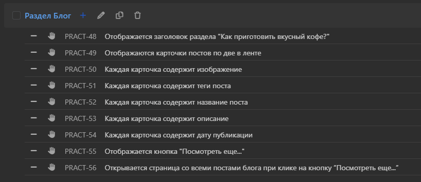

# Практикум. Создание чек-листов по документации

Задание на практикуме: составление чек-листов по проекту с обязательным использованием техник тест-дизайна.

- Стенд: https://test-stand.gb.ru/seminar_stands/coffee/index.html

- Документация: https://docs.google.com/document/d/1PLkucgibKf-

- Выгрузка чек-листа из TMS Qase: https://drive.google.com/file/d/1kZP1gKv9KCOevKYt4E3ue64EjW1drMvR/view?usp=sharing

## Чек-лист проверок

